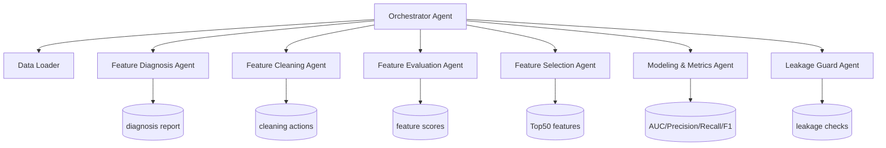

# Q2 Agent 系统设计文档（方向 A：自动化特征工程）

## 1. 架构图



## 2. Agent 职责

- **Orchestrator Agent**：串联任务，控制执行顺序，写总日志。
- **Feature Diagnosis Agent**：遍历 `X1~X300`，生成缺失率、IQR异常比例、偏度、峰度等统计。
- **Feature Cleaning Agent**：
  - 缺失率 > 35%：删除；
  - 其余缺失：中位数填充；
  - IQR 异常比例 > 8%：1%-99% winsorize。
- **Feature Evaluation Agent**：训练集上计算互信息与随机森林重要性。
- **Feature Selection Agent**：
  1. 先取综合排名前 120；
  2. 再按相关性阈值（0.92）做冗余剔除；
  3. 输出 Top50。
- **Modeling & Metrics Agent**：用 LogisticRegression 对 `Y1` 做二分类（1 vs 非1），输出 AUC/Precision/Recall/F1。
- **Leakage Guard Agent**：时间切分、时间边界检查、特征-目标异常相关检查。

## 3. Prompt（完整模板）

```text
系统角色：你是金融时序特征工程的自治 Agent。
目标：在禁止未来信息泄漏的前提下，从 X1~X300 中筛选 Top50，并输出可解释报告。
约束：
1) 仅使用训练时间段统计量进行建模；
2) 每个特征必须记录“诊断->处理->评分->筛选结论”；
3) 指标必须包含 AUC/Precision/Recall/F1；
4) 输出可视化：数据概况、ROC、混淆矩阵、Top特征图。
工具：pandas/numpy/sklearn/matplotlib/seaborn。
异常处理：缺失、常数列、极端值、类别不平衡、指标计算失败时回退到 zero_division=0。
输出：summary json + reports csv + logs jsonl + notebook 可见结果。
```

## 4. 工作流设计

1. 读取 `Q2/data` 全部分片 parquet 并按 `trade_date` 排序。
2. 生成诊断报告：`feature_diagnosis_report.csv`。
3. 执行清理并写 `feature_cleaning_actions.csv`。
4. 训练集（前80%时间）上评估特征有效性，生成综合评分。
5. 多轮筛选得到 Top50，写 `top50_features_with_scores.csv`。
6. 训练分类器，输出指标与图（ROC、混淆矩阵、Top20重要性）。
7. 执行泄漏检查并输出 `leakage_checks.json`。
8. 全流程日志写入 `agent_run_log.jsonl`。

## 5. 异常处理机制

- **数据缺文件**：抛出 `FileNotFoundError`。
- **缺失过高特征**：直接删除，避免噪声填充。
- **指标异常（0除）**：`zero_division=0`。
- **类别不均衡**：使用 `class_weight='balanced'`。
- **泄漏风险**：强制时间切分，且在报告中写出训练/测试时间边界。

## 6. 输出材料清单

- 代码：`Q2/code/agent_feature_system.py`
- Notebook：`Q2/Q2.ipynb`（已执行）
- 日志：`Q2/output/logs/agent_run_log.jsonl`
- 报告：`Q2/output/reports/*.csv|*.json`
- 图表：`Q2/output/figures/*.png`
